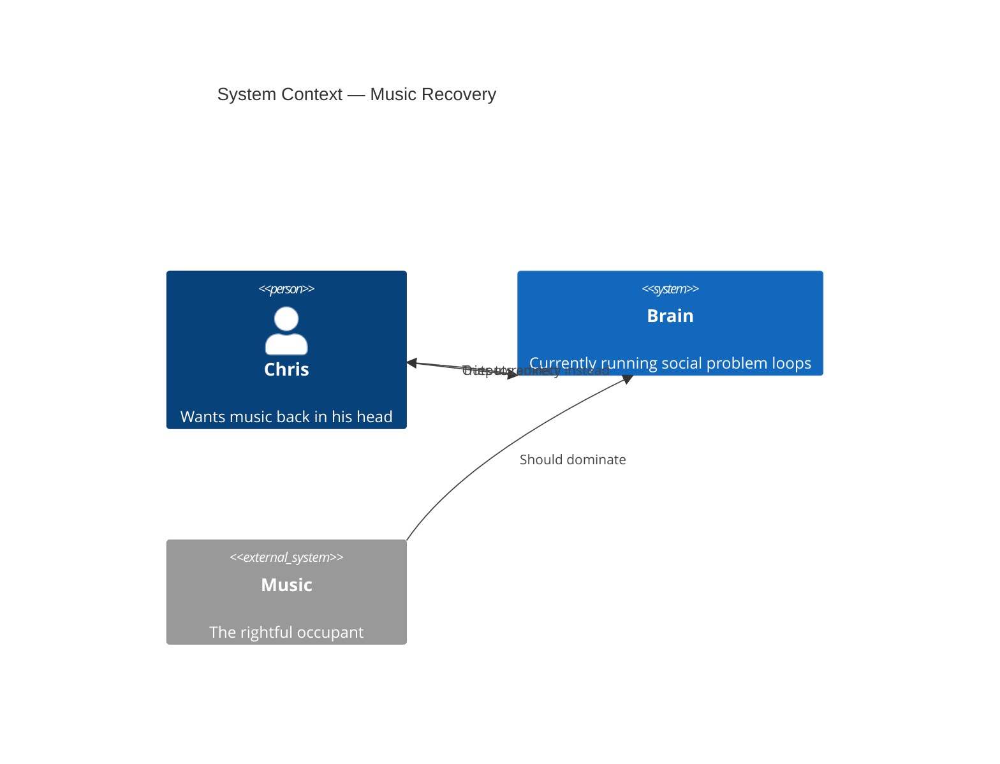

Waking up with yesterday's intractable social problems as the first thing in your head instead of music (the usual) is a leading indicator that change is required. I want my music back.

```mermaid
C4Context
  title System Context — Music Recovery
  Person(chris, "Chris", "Wants music back in his head")
  System(brain, "Brain", "Currently running social problem loops")
  System_Ext(music, "Music", "The rightful occupant")
  Rel(chris, brain, "Tries to redirect")
  Rel(music, brain, "Should dominate")
  Rel(brain, chris, "Outputs anxiety instead")
```
